````markdown
# Part 2 — Notification Service

## 1. Notification enters the system

A service such as an **Auth Service**, **Order Service**, or **Marketing Service** sends a notification request to the Notification Service.

For example:

> "Send a password-reset notification to user 123."

The Notification Service is the **front desk** of the system. Other services don't need to know whether the notification will eventually be sent by email, SMS, or push.

```mermaid
flowchart TD
    A[Client Service] --> B[Notification Service]
````

---

## 2. Check user preferences

Before doing anything else, the Notification Service checks the user's preferences.

For example:

```mermaid
flowchart TD
    A[Notification Request] --> B[Notification Service]
    B --> C[(User Preferences DB)]
    C --> B
```

A user's preferences might look like:

```text
User 123
├── Email: ON
├── SMS: OFF
├── Push: ON
└── Quiet hours: 22:00–08:00
```

This handles:

* Global opt-outs
* Per-channel preferences
* Quiet hours

### Analogy

Think of a **hotel receptionist**.

Before calling a guest's room, the receptionist checks the guest's instructions:

> "Don't call my room after 10 PM."

The system should respect those instructions **before putting the notification into the delivery pipeline**.

For transactional notifications such as password resets, quiet hours can be bypassed because delaying them could prevent the user from completing an important action.

---

## 3. Decide the priority

The system determines whether the notification is **transactional** or **bulk**.

### Transactional

Examples:

* Password reset
* Login verification code
* Order confirmation

These need to be close to real-time.

### Bulk

Examples:

* Marketing campaigns
* Newsletters
* Promotional notifications

These can tolerate delays.

The notifications are therefore separated into different queues:

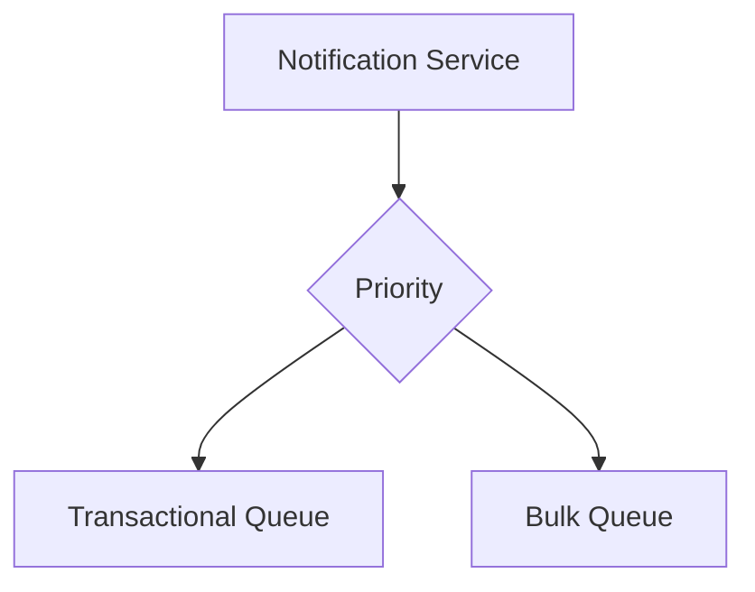

### Analogy

Think of a **hospital emergency room**.

A person having a heart attack doesn't wait behind 500 people getting routine checkups.

Transactional notifications are the **emergencies**.

Bulk notifications are the **routine cases**.

This allows transactional traffic to remain responsive even when a huge marketing campaign creates millions of notifications.

---

## 4. Route to the appropriate channel

The notification is then routed to the appropriate channel.

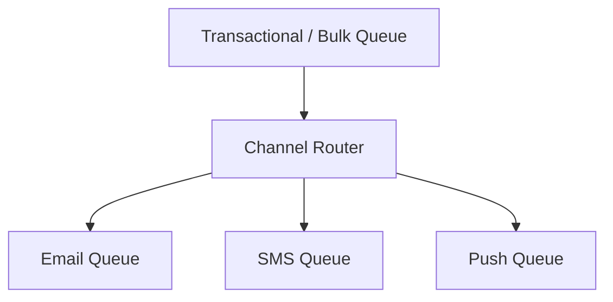

Each channel has its own worker:

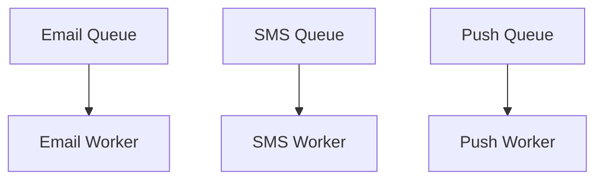

### Why separate them?

Suppose the SMS provider is having problems.

We don't want that to stop email notifications from being processed.

It's like having **three checkout lines in a supermarket**.

If one cashier is having problems, the other cashiers can continue serving customers.

This also makes the system extensible. If we later add another channel such as WhatsApp, we can add another queue and worker without redesigning the entire Notification Service.

---

## 5. De-duplication and idempotency

The queues provide **at-least-once delivery**.

The goal is:

> **Don't lose the notification, even if it has to be processed more than once.**

For example:

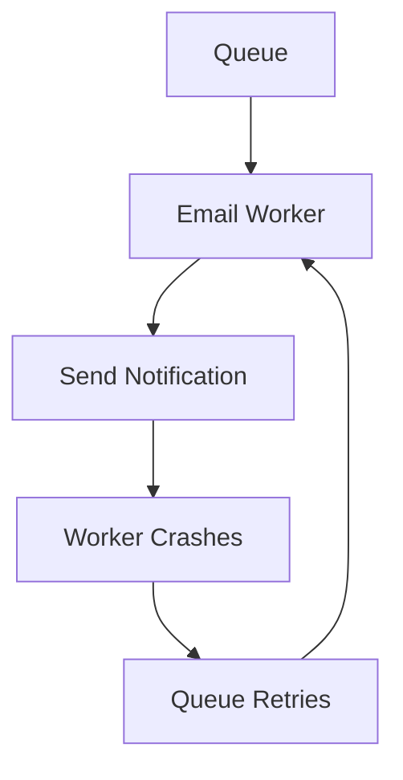

The same notification might therefore reach the worker twice.

Every notification has a unique ID:

```text
notification_id = 4471
```

The worker uses this ID to determine whether the notification has already been processed.

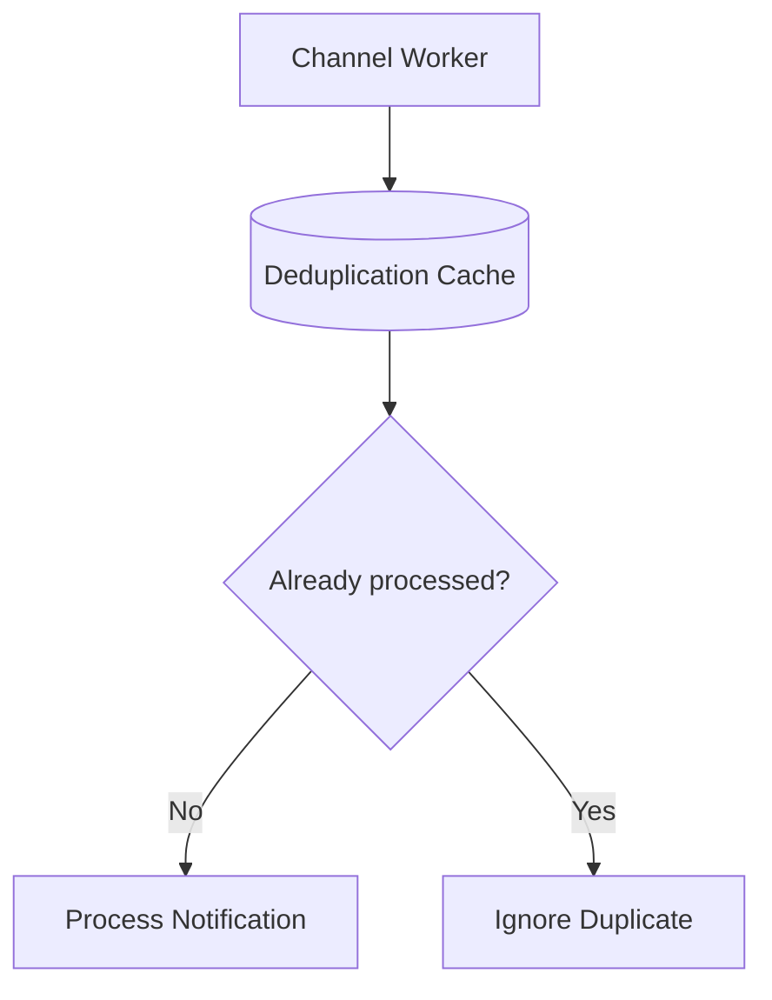

### Analogy

Imagine sending a package with:

> **Package #4471**

If the delivery company accidentally receives the same package twice, the tracking number lets them recognize that it is the same package rather than treating it as a completely new package.

The goal isn't necessarily to prevent duplicate **messages from existing**.

The goal is to prevent duplicate **effects**.

This is why we use **idempotency and deduplication**.

---

## 6. Send through the external provider

The channel worker contacts the appropriate third-party provider.

For email:

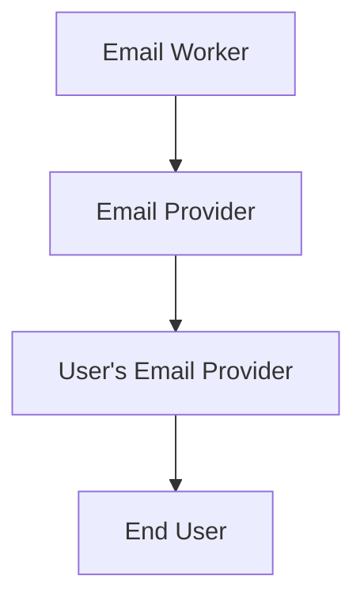

For SMS:

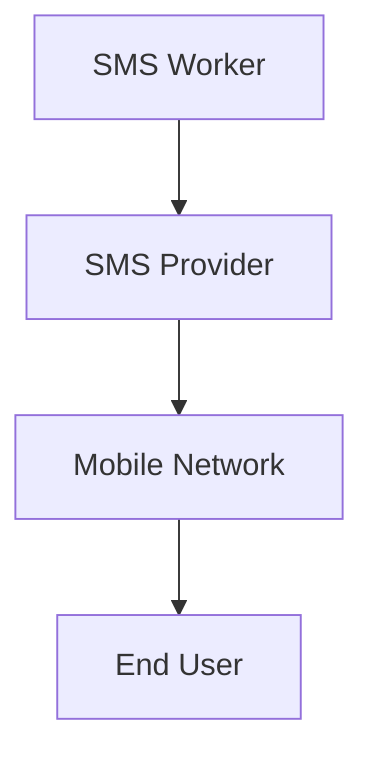

The important thing is that these external providers are **not fully under our control**.

They can:

* Fail
* Timeout
* Rate-limit us
* Become temporarily unavailable

Therefore, the Notification Service must be designed to tolerate these failures.

---

## 7. Retries and failover

Suppose the Email Worker calls the email provider and receives a timeout:

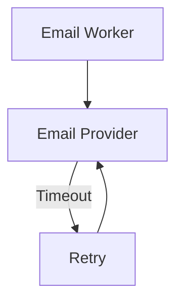

A timeout does **not necessarily mean the email was not sent**.

The provider might have:

1. Never received the request.
2. Received it but failed.
3. Received it and sent the email, but the response was lost.

This uncertainty is why retries must be combined with **idempotency**.

For temporary failures, we can retry with increasing delays:

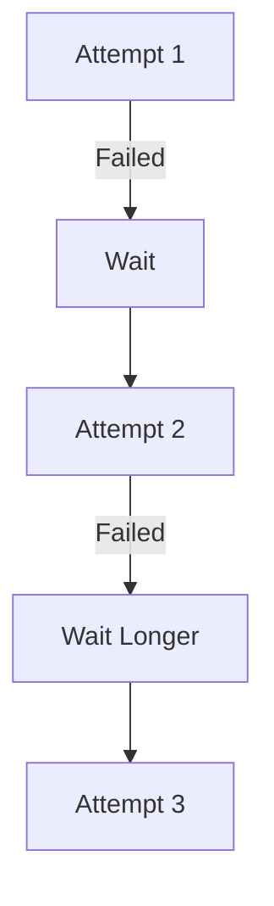

This is commonly called **exponential backoff**.

If a provider remains unavailable, the system can fail over to another provider where appropriate:

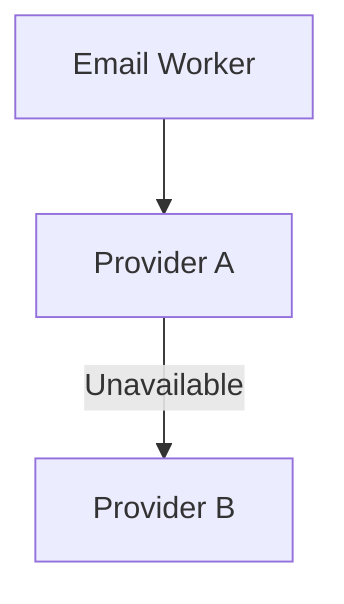

The exact retry limits and failover policy depend on the guarantees and limitations of the providers.

---

## 8. Track delivery status

We need to know what happened to every notification.

A simplified lifecycle is:

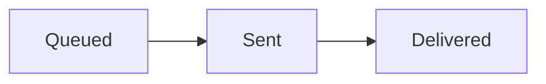

A notification can also fail:

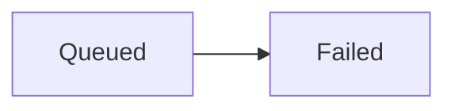

There is an important distinction between **sent** and **delivered**.

When our worker receives a successful response from the provider, that generally means:

> "The provider accepted the request."

It does **not necessarily mean**:

> "The user has received the notification."

The provider may later send our system a webhook:

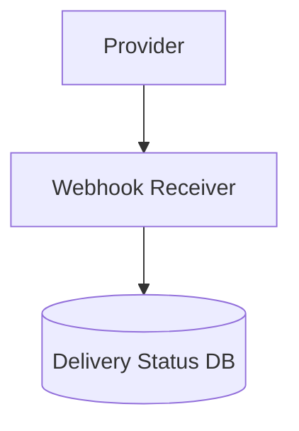

For example:

```text
Notification #4471
Status: Delivered
```

### Analogy

Think of sending a physical package.

The courier saying:

> "We've accepted your package."

is different from:

> "The package has been delivered to the customer."

Our system needs to track both stages.

---

## 9. Handling 10 million notifications per day

10 million notifications per day is approximately:

```text
10,000,000 / 86,400 ≈ 116 notifications/second
```

The bigger challenge is **traffic spikes**.

For example, a marketing campaign might suddenly generate millions of notifications.

We don't want millions of requests hitting our external providers simultaneously.

The queues act as a **buffer**:

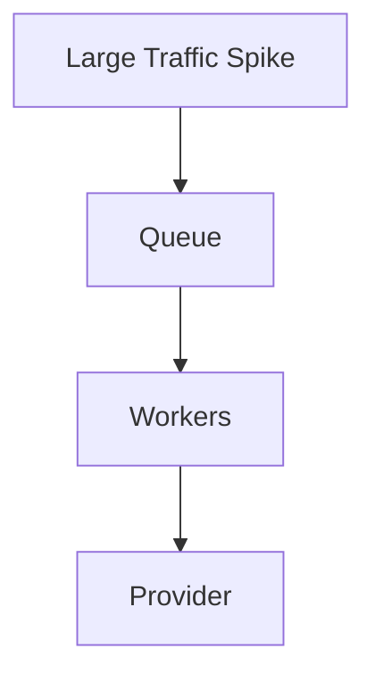

### Analogy

Think of a **dam**.

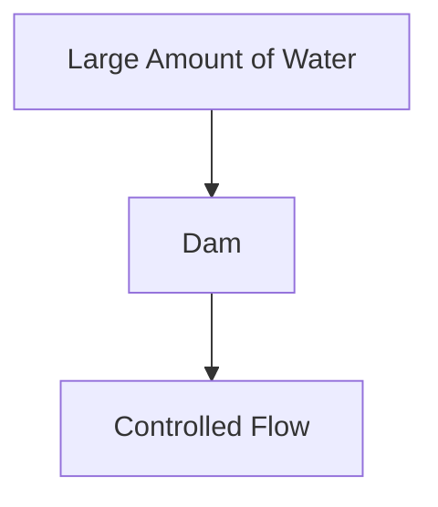

The marketing campaign can put a huge number of notifications into the queue.

Workers can then process them at a controlled rate based on available capacity and provider rate limits.

Workers can also be scaled horizontally:

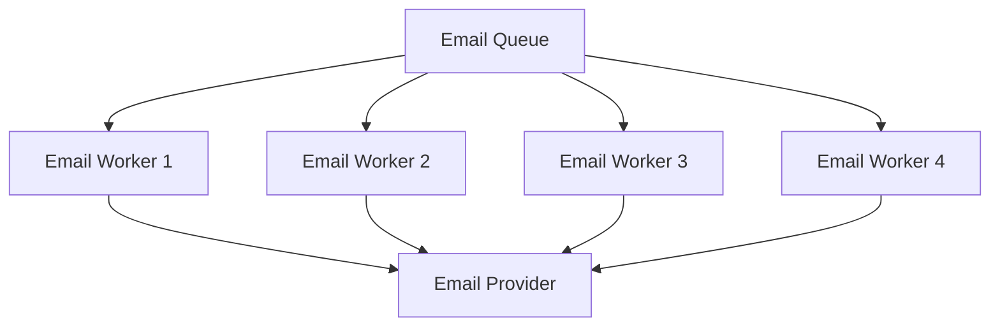

This allows processing capacity to increase when traffic increases.

---

# 10. The entire journey

Putting everything together:

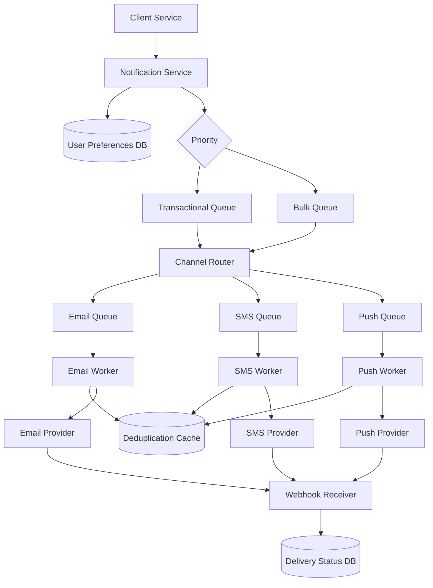

The important idea is that **each stage has one main responsibility**:

| Stage                | Responsibility                      |
| -------------------- | ----------------------------------- |
| Notification Service | Accept and prepare notifications    |
| Preferences DB       | Store user notification preferences |
| Priority Queues      | Separate urgent from bulk traffic   |
| Channel Queues       | Buffer email/SMS/push independently |
| Channel Workers      | Process and send notifications      |
| Deduplication Cache  | Make repeated processing safe       |
| Providers            | Actually deliver the notification   |
| Webhook Receiver     | Receive delivery events             |
| Delivery Status DB   | Track notification state            |

---

# The Big Picture

The architecture is essentially solving four major problems:

### Don't lose work

Use **queues + at-least-once delivery**.

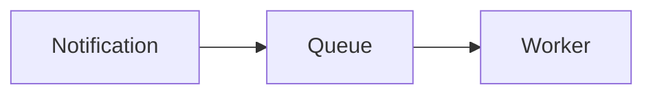

If the worker fails, the queue can make the notification available again.

### Don't send the same notification twice

Use **unique notification IDs + idempotency/deduplication**.

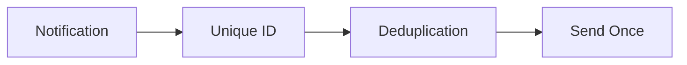

### Don't let one channel or provider break everything

Use **separate channel queues/workers and provider failover**.

```mermaid
flowchart TD
    A[Notification] --> B[Channel Router]
    B --> C[Email]
    B --> D[SMS]
    B --> E[Push]
```

### Don't let a huge bulk campaign make password resets slow

Use **priority separation between transactional and bulk traffic**.

```mermaid
flowchart TD
    A[Notifications] --> B{Priority}
    B --> C[Transactional Queue]
    B --> D[Bulk Queue]
```


