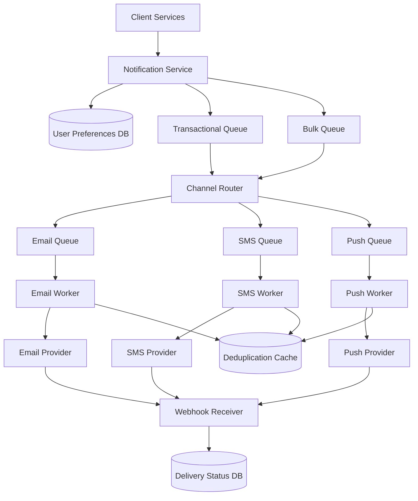

# Part 1 
## In-Memory Rate Limiter

Used a test-driven development approach: for each requirement, I wrote a failing test first, then wrote just enough code to make it pass. This covers the sliding window policy plus an interchangeable token bucket, both built behind the same interface so either can be swapped in.

A few key decisions: idle keys are cleaned up with a periodic sweep rather than just on-the-fly, since cleaning up only when a key is used again means keys that go quiet forever would never get removed. Thread safety is handled with a single shared lock wrapping the limiter, simpler than a lock per key, though it means less concurrency under heavy load.

With more time, I'd add a lock per key instead of one global lock, run cleanup automatically on a timer instead of calling it manually, and swap in a real datastore like Redis so the limiter works across multiple processes, not just one.

## Part 2 : Architecture Design
